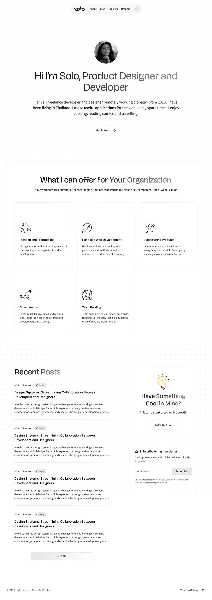

# 🚀 Loop Portfolio V2

A sleek and modern personal portfolio website built using **React.js**, **Tailwind CSS**, **AOS (Animate On Scroll)**, and **Vite**.  
It features a dark/light mode toggle, animated components, and a fully responsive layout.

## 🌐 Live Site

👉 [View Live Website](https://loopportforlio.netlify.app/)

---

## 📸 Preview

---

## ✨ Features

- ⚛️ Built with **React** + **Vite**
- 🎨 Styled using **Tailwind CSS**
- 🌙 Dark/Light Mode Toggle
- ✨ AOS scroll animations
- 📱 Responsive for all devices
- 🚀 Deployed with **Netlify**

---

## 🧪 Tech Stack

- React.js
- Tailwind CSS
- AOS (Animate On Scroll)
- Vite
- Netlify
